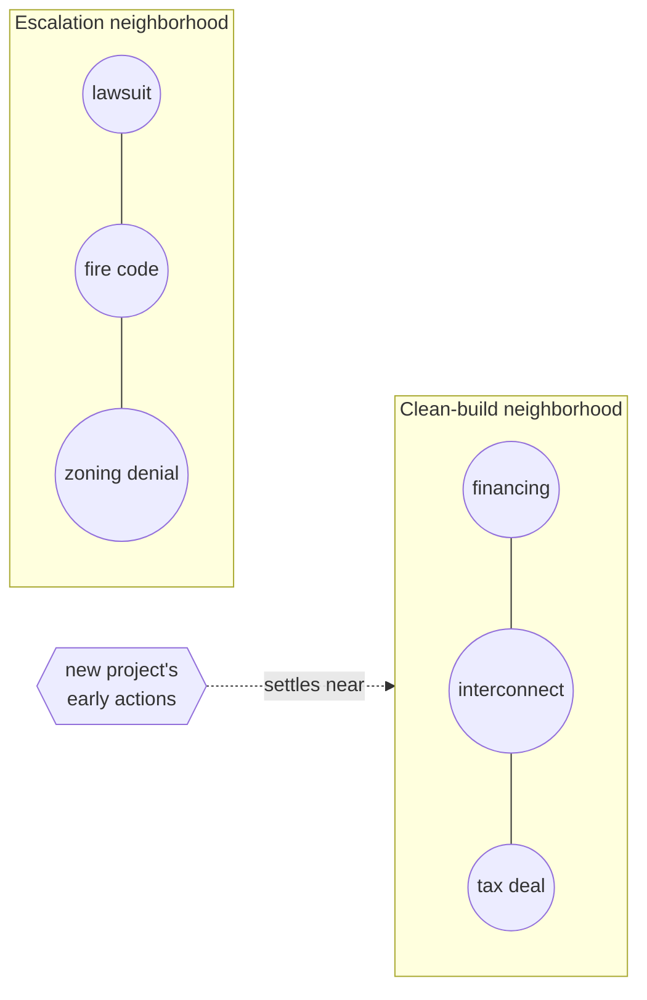
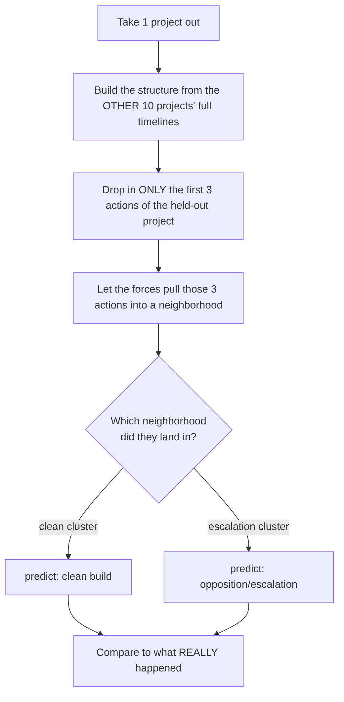

# Emergence

**A system that doesn't store data and look it up. It absorbs data, and the
structure changes. The answer is *where a new thing lands* — not a record you
fetch.**

Tested on real permitting data: drop the first few actions of an unseen battery
project into a structure built from other projects, and the neighborhood those
actions settle into tells you what's likely to happen — **without ever telling
the system the outcome.** 8 of 11 held-out cases land in the right territory.

---

## Demo

<!--
  TO EMBED THE VIDEO SO IT PLAYS INLINE:
  1. Open any GitHub issue/comment box on this repo (or the README editor on github.com).
  2. Drag `Experiment_v1/Demo.mov` into it. GitHub uploads it and gives you a
     link like  https://github.com/user-attachments/assets/xxxxxxxx
  3. Replace the placeholder line below with that link (on its own line).
     GitHub will render it as an inline video player automatically.
-->

https://github.com/user-attachments/assets/REPLACE_WITH_UPLOADED_VIDEO_URL

> ▶️ *Video not showing yet? See the note above — drop `Experiment_v1/Demo.mov`
> into a GitHub comment box to get the embeddable link.*

Pick a held-out case from the dropdown. The other cases settle into their
natural clusters. Click **inject case** and watch the hidden early actions drift
to where they belong. The card reads the result in plain English.

---

## The Idea, in plain words

Most software treats data as dead stuff. You put a record in a box, you label
the box, and later you go find the box. The answer is a **lookup**.

This is different. Here, every piece of data is an **atom**. Atoms feel
**forces** toward each other. Strong force → they **bind**. Bind enough of them
and **structure appears on its own** — clusters, then clusters-of-clusters — the
same way atoms become molecules become living tissue. Nobody hand-draws the
clusters. The forces decide.

And you don't *query* it. You **drop a new thing in and watch where it settles.**
Its neighborhood is the answer.

### The ladder: atom → bond → molecule → organism

```
   ONE ATOM  = one event                 (e.g. "county adopts fire code")

         e⁻
          \
       (  ⊕  )
          /
         e⁻


   A BOND  = a strong force between two events

     (  A  )●━━━━━━━━●(  B  )
        same kind of action?  same level of government?
        close together in time?   →  they attract and bind


   A MOLECULE  = many bonds → a "neighborhood" of similar events

              (  A  )
             ╱   |   ╲
         (  B )  |  (  D  )
             ╲   |   ╱
              (  C  )


   THE ORGANISM  = the whole self-organized structure

   ┌─────────────────────────────┐   ┌───────────────────────────────────┐
   │  CLEAN-BUILD neighborhood    │   │  OPPOSITION / ESCALATION          │
   │  molecules of financing,     │   │  neighborhood                     │
   │  interconnection, tax deals  │   │  molecules of lawsuits, fire-code │
   │                              │   │  enforcement, zoning denials      │
   └─────────────────────────────┘   └───────────────────────────────────┘
```

The same thing as a graph (this is literally what the code builds):



---

## How it actually works (the science, kept simple)

**1. What is an atom?**
One regulatory event from a project's timeline — a filing, a lawsuit, a county
resolution, an interconnection agreement. 100 real events across 11 Texas
battery-storage (BESS) projects.

**2. What is the force?**
An explicit, readable formula — *no AI black box, no embeddings.* Two events
attract based on five plain features (`scripts/run_test.py`, function
`similarity`):

| Force | Weight | In plain words |
|---|---:|---|
| same **mechanism** | 0.30 | is it the *same kind* of action? (lawsuit vs. financing) |
| same **jurisdiction** | 0.20 | is it the *same level* of government? (city vs. federal) |
| **position in timeline** | 0.20 | do they happen at a similar stage of the project? |
| **agency level** | 0.20 | how high up the ladder? (citizen `0` → federal `5`) |
| **time gap** | 0.10 | is the pause before it a similar length? |

Add them up. If the total is strong enough (`≥ 0.5`), a bond forms. That's the
entire physics of this universe — five lines you can read and argue with.

**3. How do we ask a question — without cheating?**
The honest test, called **leave-one-out**:



The system is **never told the outcome.** It only sees the first 3 moves. The
prediction is simply the *company it keeps.*

---

## What we found

Sorted by real outcome. `esc%` = how much of the landing neighborhood was
escalation-type events; `clean-neigh%` = how much came from clean projects.

| Project | Real outcome | esc% | clean-neigh% |
|---|---|---:|---:|
| Sun Valley | clean | **0%** | 60% |
| Anemoi | clean | 13% | 40% |
| Apache Hill | under construction | 13% | 66% |
| Flat Rock | **withdrawn** | 40% | 6% |
| Rogers Draw | escalation | **93%** | 0% |
| Black Mountain | escalation | 60% | 13% |
| Van Zandt | escalation | 46% | 20% |
| Marshall Springs | escalation | 40% | 33% |

**Read it in one line each:**

- **Clean projects land in clean neighborhoods.** Their early moves (financing,
  grid interconnection, tax abatements) look like other calm projects.
- **Escalation projects land in escalation neighborhoods.** Rogers Draw's first
  moves already sit 93% among lawsuits and fire-code fights.
- **The withdrawn project (Flat Rock) lands in escalation territory — and that's
  correct.** It was *killed by opposition.* The structure sensed that from its
  first 3 actions alone, having never been told.

**8 of 11 land where they should.**

### Why the misses make it *more* trustworthy, not less

Real science fails in ways you can explain. All 3 misses do:

- **Kiskadee (clean, but scored 26% esc)** — it bound to `interconnection`
  events that clean *and* stormy projects both have. The formula is honestly
  telling us: *regulatory features alone don't fully separate projects — add
  more forces (project size, distance to homes).*
- **Platinum (20%)** — opposition started *years* after its first 3 actions. A
  3-action window simply can't see a fight that hasn't begun. A limit of the
  question, not the method.
- **Katy (only 6 neighbors)** — it's the only project with a `zoning denial`, so
  nothing else in the data can bind to it. Not a failure — a gap in the dataset.

None of these are bugs. Each one points at the next experiment. **A system that
fails legibly is doing science.**

---

## Run it yourself

```bash
python -m venv .venv && source .venv/bin/activate
pip install -r requirements.txt
python scripts/parse_data.py      # CSV → Data/events.json
python scripts/run_test.py        # runs the leave-one-out test, writes viewer data
open viewer/index.html            # the visual demo
```

No database. No server. The whole structure is rebuilt in memory every run —
which also means it's fully reversible: change the data, re-run, the structure
re-forms.

---

## What's where

| Path | What it is |
|---|---|
| `viewer/index.html` | the visual demo (D3 force layout) — **start here** |
| `scripts/run_test.py` | the force function (`similarity`) + the leave-one-out test |
| `scripts/parse_data.py` | turns the raw CSV into classified events |
| `Data/…Regulatory Timelines.csv` | the 100 hand-curated real events |
| `Data/events.json` | parsed + classified events |
| `Experiment_v1/` | frozen v1 snapshot — `Project.pdf`, `Demo.mov`, and the code as of that milestone |

---

## Where this goes next

- **Add more forces.** Project size, distance to homes, grid-queue vintage —
  to pull genuinely different projects apart (the Kiskadee lesson).
- **From batch to living.** Today the structure is *rebuilt* each run. The real
  leap is a structure that *stays alive* and reshapes itself as each new event
  arrives — perturbing what exists instead of rebuilding it. That's the line
  between what's proven here and what comes next.
