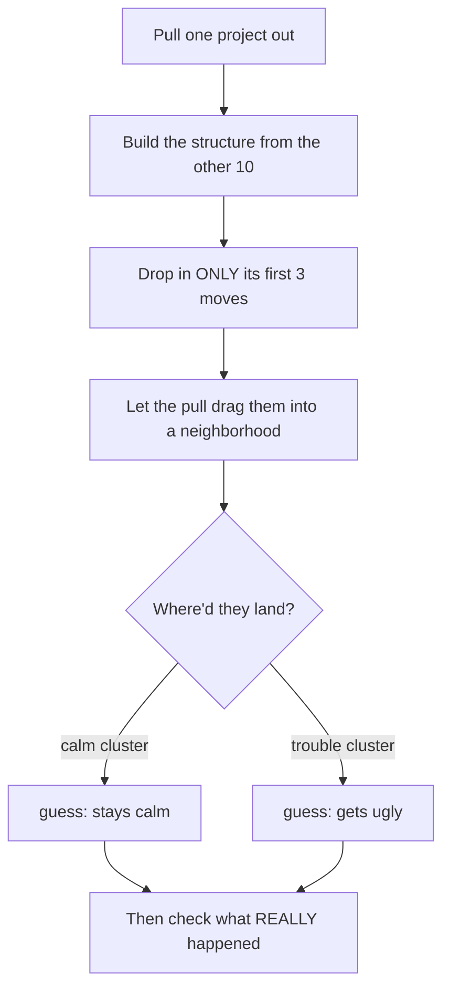

# Emergence

So here's the thing I've been building.

Most software stores data in a box, labels the box, and later goes and finds the
box. That's a lookup. I wanted the opposite — a system where you don't store and
retrieve anything. You **drop new data in, the whole structure shifts to make
room for it, and the answer is *where the new thing lands.***

To see if it holds up, I tested it on real permitting data: take a project nobody
has seen, feed in just its first few moves, and watch where they settle among a
bunch of other projects. Where they land tells you what's probably going to
happen to it — and I never tell the system the outcome. **Out of 11 projects, 8
landed exactly where they should have.** The 3 that missed are the interesting
part; I'll get to them.

---

## What problem does this solve?

If you're building big infrastructure — a **data center**, a battery farm, a
substation — you sink tens or hundreds of millions into it *before* you know
whether the town and the regulators will let it happen. Plenty of these projects
get quietly strangled: lawsuits, zoning denials, fire-code fights, county
moratoriums. And by the time the opposition is obvious, the money's already
spent. There's basically **no early warning** — you find out you're in a knife
fight after you've already brought a checkbook.

That's what I'm going after: **can you tell, from a project's first few moves,
which way it's leaning — quiet build or headed for a fight?** Not by guessing, but
by matching those early moves against how *other* projects that started the same
way actually turned out.

I tested it on **Texas battery-storage projects** because that's where I could get
clean records, but the same idea drops straight onto **data centers** — fought
over harder than almost anything right now — or any build a community can push
back on. The fuel's different; the fight is the same shape. Think of it as an
**early-warning system for infrastructure opposition.**

---

## Demo

https://github.com/user-attachments/assets/b2ac8e0d-8ca1-45ac-8204-0ee32fac8853

Pick a project from the dropdown. The others settle into their natural clusters.
Hit **inject case**, and the hidden early actions drift over to where they
belong. That's the whole magic trick — no smoke, no mirrors, just physics being
nosy.

---

## The idea, explained like I'd tell a friend

Every piece of data is an **atom**. Atoms feel a pull toward each other; strong
enough pull and they **stick**. Stick enough of them and structure appears on its
own — clusters, then clusters-of-clusters — the way atoms become molecules become
living stuff. I never draw the clusters by hand. The pull decides. And you don't
"search" it — you drop a new thing in and see who it sticks to. That's the answer.

```
   ONE ATOM  = one event                 (like "county passes a fire code")

         e⁻
          \
       (  ⊕  )
          /
         e⁻


   A BOND  = two events pulling hard enough to stick

     (  A  )●━━━━━━━━●(  B  )
        same kind of action?  same level of government?
        happening around the same time?   →  they stick


   A MOLECULE  = a bunch of bonds → a little "neighborhood"

              (  A  )
             ╱   |   ╲
         (  B )  |  (  D  )
             ╲   |   ╱
              (  C  )


   THE WHOLE THING  = it all sorts itself out

   ┌─────────────────────────────┐   ┌───────────────────────────────────┐
   │  the CALM neighborhood       │   │  the TROUBLE neighborhood         │
   │  financing, grid hookups,    │   │  lawsuits, fire-code fights,      │
   │  tax deals                   │   │  zoning denials                   │
   └─────────────────────────────┘   └───────────────────────────────────┘
```

---

## How it actually works

**The data.** I hand-built the regulatory timeline for **11 real Texas
battery-storage projects** — 100 events total. A timeline is just a project's
paper trail in order: filed for a grid connection, county passed a fire code,
someone sued, got its tax deal, got withdrawn. Every project ends somewhere real
— some built quietly, some got dragged through opposition, one got killed — and I
*know* every outcome, which is what lets me grade the test honestly.

**An atom** is one event off a timeline, carrying a few plain facts: what kind of
action, what level of government, and when.

**The pull** isn't an AI black box — it's five features you can read with your own
eyes (the `similarity` function in `scripts/run_test.py`):

| What pulls two events together | Weight | In normal words |
|---|---:|---|
| same **kind of action** | 0.30 | lawsuit vs. loan? |
| same **level of government** | 0.20 | city vs. county vs. federal |
| **where in the timeline** | 0.20 | early move or late move? |
| **how high up it goes** | 0.20 | random citizen `0` → federal `5` |
| **the gap before it** | 0.10 | similar pause before it happened? |

Add them up; clear `0.5` and the two events stick. That's the whole "physics" —
five lines you can argue with over coffee.

**The test, without cheating:** hold one project out, build the structure from the
other 10, then drop in **only its first 3 moves** — never the outcome — and see
where they get pulled. In real life the first 3 moves are about all a developer
would have to go on too. The point is to call the ending from the opening.



---

## What actually happened

`esc%` = how much of the landing neighborhood was trouble-type events;
`clean-neigh%` = how much came from calm projects.

| Project | How it really ended | esc% | clean-neigh% |
|---|---|---:|---:|
| Sun Valley | fine | **0%** | 60% |
| Anemoi | fine | 13% | 40% |
| Apache Hill | still building | 13% | 66% |
| Flat Rock | **got killed** | 40% | 6% |
| Rogers Draw | got ugly | **93%** | 0% |
| Black Mountain | got ugly | 60% | 13% |
| Van Zandt | got ugly | 46% | 20% |
| Marshall Springs | got ugly | 40% | 33% |

- **Calm projects hung out with calm projects** — their first moves (financing,
  grid hookups, tax deals) looked like everyone else's boring paperwork.
- **The messy ones outed themselves early** — Rogers Draw's first three moves were
  already 93% surrounded by lawsuits and fire-code fights.
- **The one that got withdrawn (Flat Rock) landed in trouble territory — exactly
  right.** It got killed by opposition, and the structure smelled it from 3 moves.

**8 of 11 landed where they should. Honestly better than I expected — I braced
for a pile of noise and got a signal instead.**

**The 3 misses I actually like** (a thing that never explains its misses isn't
trustworthy):

- **Kiskadee** (calm, scored a bit trouble-y) stuck to grid-hookup events that
  *both* calm and messy projects have — the system telling me paperwork alone
  won't separate these; feed it more (project size, distance to houses).
- **Platinum** flagged low because its fight didn't start until *years* after its
  first 3 moves. You can't see a fight that hasn't started.
- **Katy** barely stuck to anything — it's the only project with a zoning denial,
  so nothing else matches it. That's a data gap, not a method failure.

None are bugs. Each is a to-do for the next version wearing a trench coat.

---

## Run it yourself

```bash
python -m venv .venv && source .venv/bin/activate
pip install -r requirements.txt
python scripts/parse_data.py      # CSV → Data/events.json
python scripts/run_test.py        # runs the test, writes the viewer data
open viewer/index.html            # the visual demo
```

No database, no server. The structure rebuilds from scratch in memory every run,
which also makes it fully reversible — change the data, run again, it re-forms.

## What's where

| Path | What it is |
|---|---|
| `viewer/index.html` | the visual demo — **start here** |
| `scripts/run_test.py` | the pull formula (`similarity`) + the hold-one-out test |
| `scripts/parse_data.py` | turns the raw CSV into clean events |
| `Data/…Regulatory Timelines.csv` | the 100 real events, collected by hand |
| `Experiment_v1/` | frozen v1 — `Project.pdf`, `Demo.mov`, and the code as it was then |

## Where this goes next

- **More forces** — project size, distance to houses, grid-queue vintage — to
  pull genuinely different projects apart (the Kiskadee lesson).
- **From "rebuild every run" to "keep it alive"** — a structure that stays live
  and reshapes itself as each new event arrives, instead of starting over. That's
  the gap between what I've proven and where this is headed.
